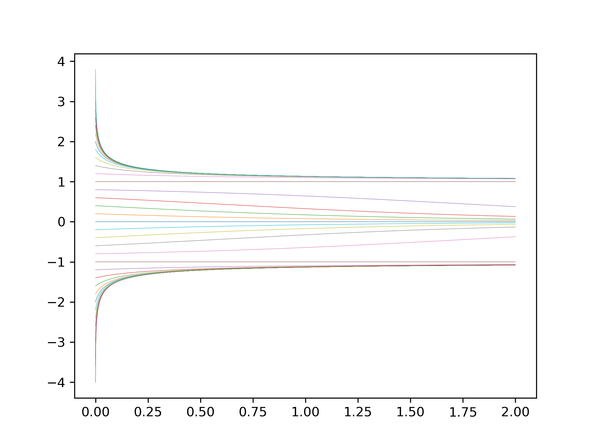
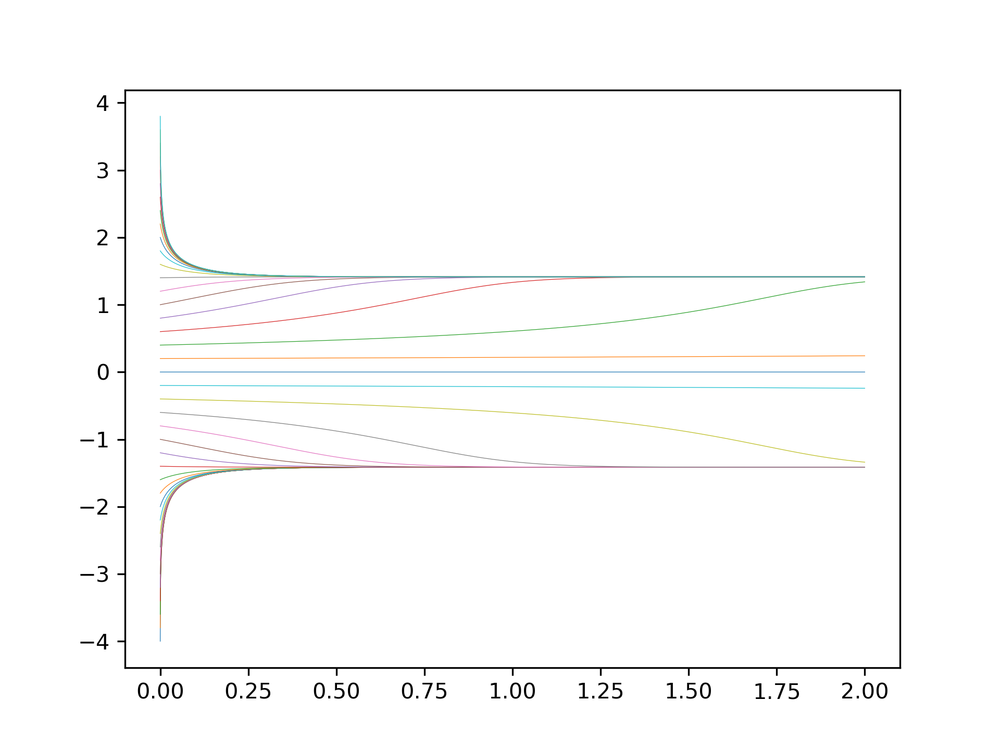
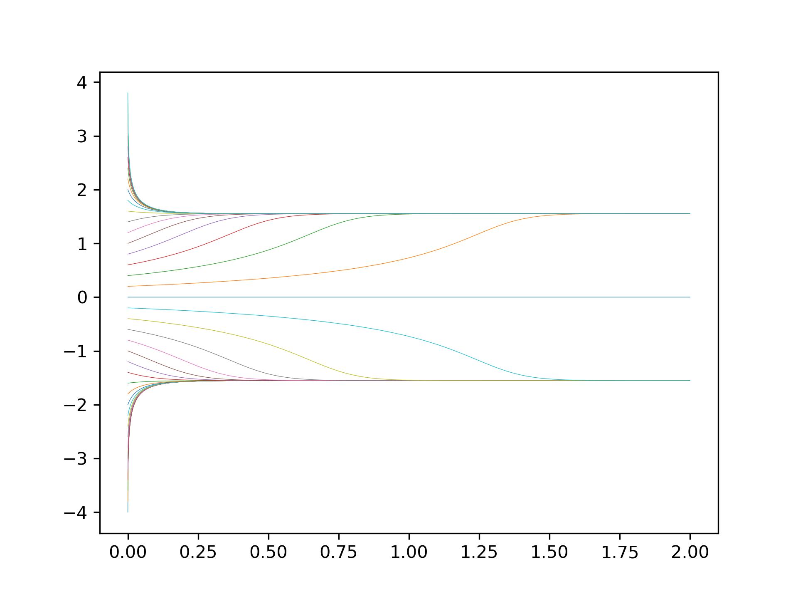

Betriebssysteme und Netzwerke (IBN)

# Sheet 1

## Exercise 1

### (a)

We chose step sizes $\Delta\tau$ of different orders of magnitude (from 0.0001 to 1). As one can see the result heavily depends on the chosen step size. For $\Delta\tau = 1$ we observe huge jumps between the evaluated points but eventually it converges to the attracting fixpoint. For smaller steps sizes the trajectory gets increasingly smoother, but with decreasing improvement. Compared to the steady increase in computational effort it is advised to choose the step size small enough to get a smooth trajectory and to avoid jumping over features (e.g. jumping on the other side of a critical fixpoint) but large enough to keep the the required computation time low.

### (b)

Placing the starting points on the edge of [0, 2]x[0, 2] leads to trajectories that are spiraling in. Because of this the trajectories tend to cluster when they started towards the corners of the given intervall.

Placing the starting points on a circle leads to nearly uniformly distributed trajectories, but results in a similiar pattern. Only the fact that the fixpoint is not directly centered leads to deviations.

\newpage

## Exercise 4

With $\mu < 0$ we have identified 2 different cases: the first one can be seen on the lower end of the starting points where there is no saddle point visible. The second case contains the inflection point in the trajectory. This inflection point hints the emergence of a fixpoint.

Here with $\mu = 0$ we have three cases dominated by the critical point at 0. First case is everything above 0 that gets attracted by the critical point. The second case is the static one at the fixpoint and the third case is described by the diverging trajectories below the fixpoint.

The emergence of two fixpoints for $\mu > 1$, one attracting and one repelling leads to six different cases. Again we have the trajectories above the attracting fixpoint that converge and the static case in the fixpoint. Additionally we have trajectories between both fixpoints that get attracted to the upper fixpoint. In the plot one cannot see the two types that are similar to the case with $\mu = -1$ with one including and one excluding the inflection point. Right next to the ones getting attracted by the upper fixpoint we have the static trajectory in the lower fixpoint followed by diverging trajectories to negative infinity. 
\newpage

## Exercise 5

Here you can see a single attreacting fixpoint at 0. 

With $\mu = -1$ the we can see the emergence of two critical fixpoints above an beneath the attracting one. Both have a attracting and repelling side.

With $\mu$ between -1 and 0 the two critical fixpoints splitted up into a repelling one on the side to the center fixpoint and an attracting fixpoint on the outside each.

At $\mu = 0$ both outer fixpoints stay attractive while the inner two repelling ones merge with the previous attractive one at 0 and form a weakly repelling fixpoint.

For $\mu > 0$ we have a repelling fixpoint at 0 and the two outer attractive fixpoints.
\newpage

## Appendix

\lstinputlisting[language=python]{sheet01.py}
