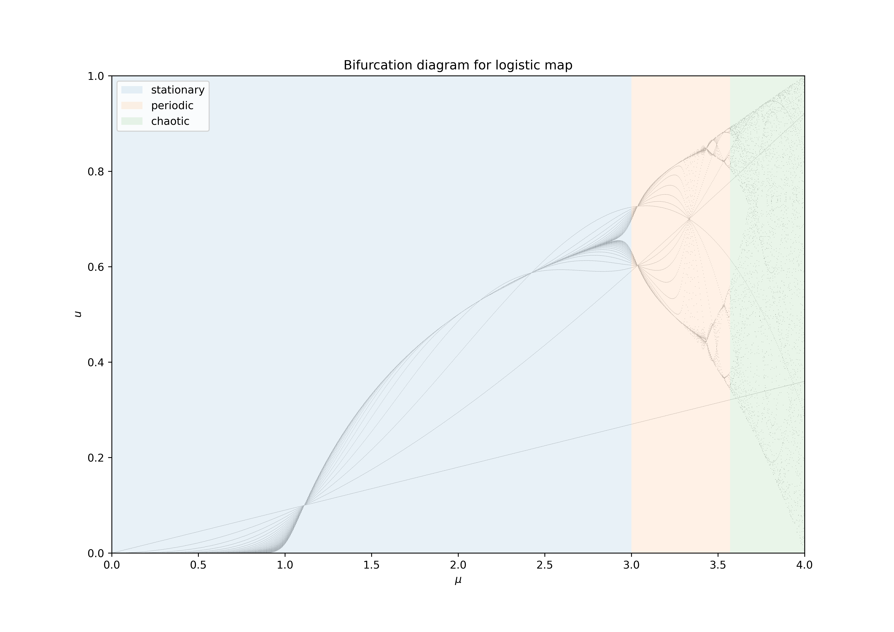

# Exercise 3

In the following plots, we're still examining the same logistic map from the previous
exercise - however, this time, we don't discard the first 4000 iterations. Therefore,
the following observations and explanations focus on the details which are unique to
the first few iterations of the logistic map and we won't repeat what was already
mentioned in the previous exercise, even if it naturally applies here, as well.

The main observation we can make is, that with each iteration, as expected, the
path converges more and more towards the curve we have seen after the spin-up
phase of 4000 iterations from exercise 2.

For the logistic map
$$
x_{n+1} = r x_n (1-x_n)
$$

we can find a fixpoint which is very well visible in the following plots. It's value
is the value of the initial $u_0$ itself and it is therefore
shared by each path from the different sampled iterations. Its corresponding $\mu$
value can be calculated with
$$
u \overset{!}{=} \mu u (1-u) \Leftrightarrow \mu = \frac{1}{1-u}
$$

## Plot for $u_0 = 0.1$

We can see the fixpoint at $\mu = \frac{1}{1-u} = 1.\overline{1}$.

Additionally, for the logistic map
$$
x_{n+1} = r x_n (1-x_n)
$$

we can deduce the first iteration as a linear function:
$$
u_1(\mu) = (u_0 (1-u_0)) \mu
$$

For $u_0 = 0.1$, we can calculate a slope of
$$
\left. u_0 (1-u_0) \right|_{u_0=0.1} = 0.1 \cdot 0.9 = 0.09
$$

The corresponding linear graph is visible in the plot above and can
easily be recognised. A similar graph will also be visible in each of
the following plots.
At the transition from the stationary to the periodic regime one can see that the number of iterations we chose were not enough to converge to the single stationary point on the left and the two periodic points on the right side of the transition.

\newpage

## Plot for $u_0 = 0.5$

We can see the fixpoint at $\mu = \frac{1}{1-u} = 2$.

For $u_0 = 0.5$ we observe a special case: The mentioned linear graph
of the first iteration is at its maximum out of all values for
$u_0$ with a slope of $0.25$. It makes sense that this maximum is
reached at $0.5$ due to the symmetry of the logistic map. Regarding
that symmetry, see the following two plots.

\newpage

## Plot for $u_0 = 0.3$

This plot is shown for comparison with the plot for $u_0 = 0.7$.
See below for the explanation.

\newpage

## Plot for $u_0 = 0.7$

Due to the symmetry of the logistic map, the iterations for two systems with
initial states $u_0$ and $u_0'$ behave exactly the same if they are of equal
distance to the previously discussed initial state at $0.5$:

$$
|0.5 - u_0| = |0.5 - u_0'|
$$

This is shown in the two plots for $u_0 = 0.3$ and $u_0 = 0.7$ above, which
are both $0.2$ from $0.5$.

\newpage

## Animated plot

See https://imgur.com/hGTg1gT or direct video link https://i.imgur.com/hGTg1gT.mp4

The animation validates our findings from above.
