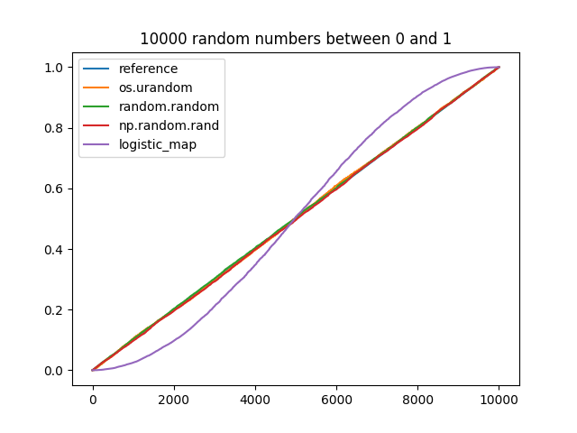

# Exercise 3

\lstinputlisting[language=Python]{sheet3_3.py}

\newpage

Looking at 10 random numbers, we cannot spot any particular
behavior of the different generation methods.

For 100 random numbers, there is still not much difference
to report.

For 1000 random numbers, the plot suggests a non-linear progress
for the numbers which were generated with the logistic map.

This behavior is amplified in the plot for 10000 numbers. While
every other method runs more or less close to the reference line,
the numbers generated with the logistic map show a distinct non-linear
behavior: Numbers close to 0 and 1 (so both ends of the interval) are
overrepresentated. There is a steep slope at the middle of the curve
which means we won't generate those numbers as frequently as the ones
towards either interval bounds.

In the transition/transfer plot shifted by 1, we can see the function
graph of the logistic map.

In the transition/transfer plot shifted by 2, we can see the function
graph of the second iterate of the logistic map.

If we shift the transition/transfer plot by 5, the expected function
graph begins to disappear.

However, after increasing the number of points, the characteristic
reappears.

In the transition/transfer plot shifted by 10, we can see the
concentration of points and overrepresentation of numbers towards
the interval bounds.
