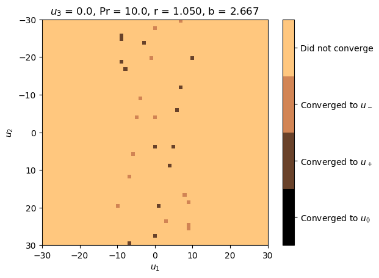
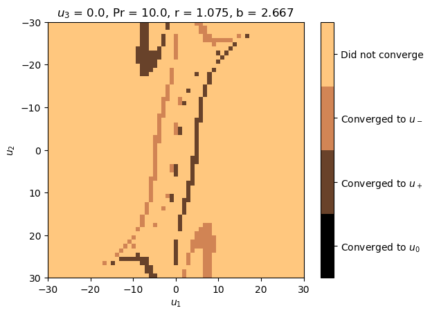
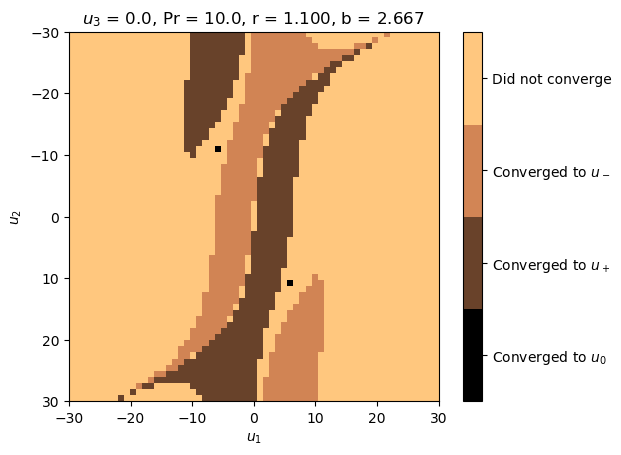
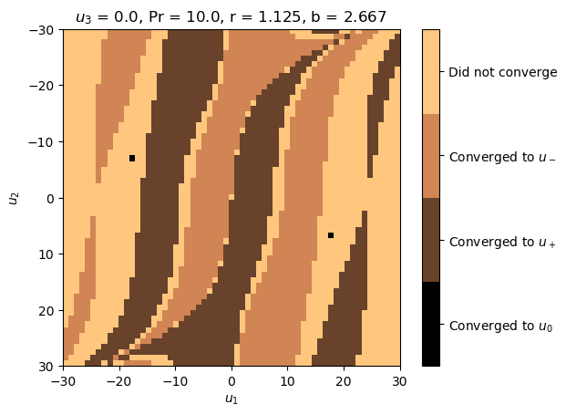
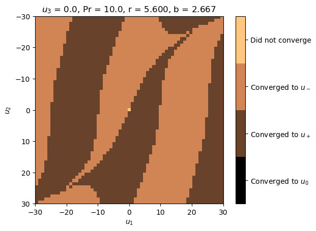
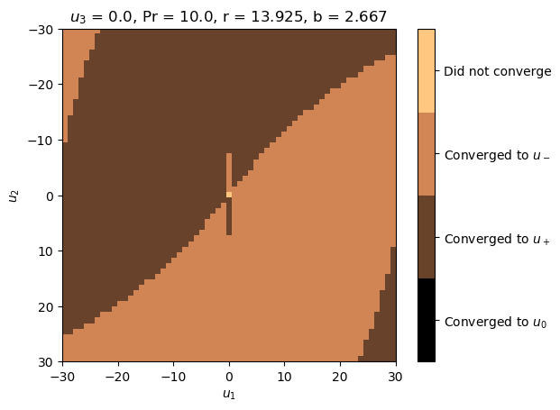
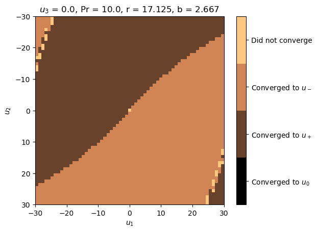
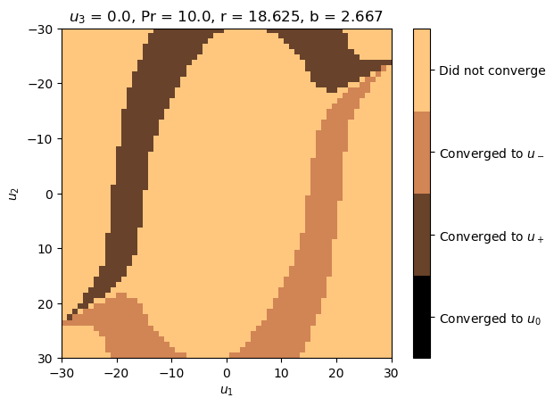
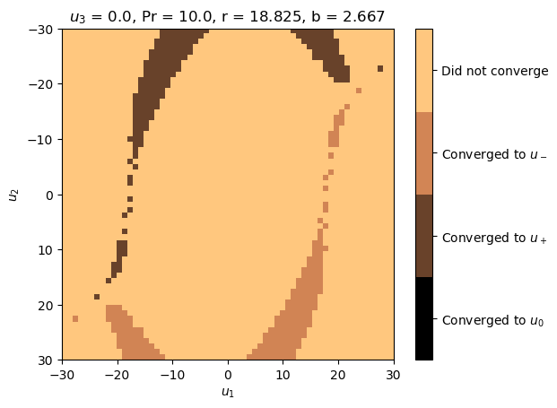

# Exercise 3

For this exercise we chose a grid of starting points within the section $[-30, 30]\bigotimes[-30, 30]$ resulting in 900 trajectories being calculated for each time step.
The distances to the fixpoints $u_0$, $u_+$ and $u_-$ where monitored and, when below the theshold of $10^{-4}$, marked according to the respective fixpoint.
Here is a collection of bitmaps for interesting values of r:

Additionally, we have created a video consisting of 980 frames showing the transformative nature of this system depending on increasing r:

[https://i.imgur.com/hP5EFrV.mp4](https://i.imgur.com/hP5EFrV.mp4)

At $r=1$, two point converge to $u_0$ while all other points do not converge at all. 
From $r=1$ to $r=1.3$, areas of convergence to $u_+$ and $u_-$ are forming. 
Beginning at r=1.3, every point converges either to $u_+$ or $u_-$ except for $(0, 0)$, which doesn't converge. 
For $r=1.3$ to $r=16.3$ we can see inverse point reflection through $(0, 0)$. 
At $r=16.3$, some points appear at the edges which don't converge. 
Those areas grow and later, the center begins to show points which don't converge, as well. 
The areas keep growing until only two converging points can be identified (one to $u_+$, one to $u_-$). 
Finally, at $r=20.235$, those points disappear, too, and none of the points converge.

Not converging in this context means that the trajectory did not come below the required distance.
Therefore, a longer simulation time could lead to more trajectories converging. 
Cycles produced by the strange attractor for larger values of r were also not investigated and not plotted.

\lstinputlisting[language=Python]{sheet5_ex3.py}
